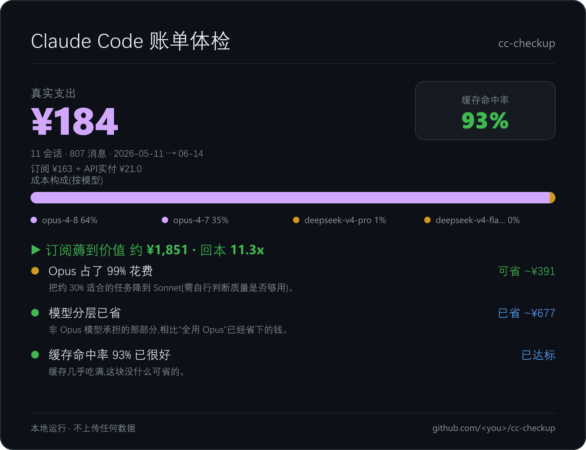

# cc-checkup

> 扒一扒你的 Claude Code 账单 —— 一行命令,本地算出**真实支出**、**订阅回本倍数**、**缓存命中率**,还能导出一张可分享的账单卡片。
> Local-only cost & cache-hit checkup for Claude Code. No data leaves your machine.



## 它解决什么

你每天用 Claude Code,但根本不知道:
- 这个月**到底花了多少**?订阅到底**回本几倍**?
- 钱花在哪了?——大头其实是你**看不见的缓存重放**(每轮把整个上下文重放一遍,动辄几千万 token)。
- 哪个项目 / 哪个模型 / 哪条分支最烧钱?

`cc-checkup` 直接读本地 `~/.claude/projects` 的 session 记录(只读 `usage` 里的 token 计数,**不碰对话正文、不联网**),把这些一次算清楚。

## 快速开始

```bash
# 不装,直接跑(读默认 ~/.claude/projects)
npx cc-checkup

# 你是 Claude 订阅用户?告诉它你的套餐,它会算"真实支出 + 回本倍数"
npx cc-checkup --plan pro

# 用人民币 + 导出一张账单卡片 PNG
npx cc-checkup --plan pro --cny --png
```

## 计费场景(关键:别把"用量价值"当成"花的钱")

工具算出的 token 价值是 **API 牌价**。但你未必按 API 付费,所以它会按你的场景如实区分:

| 你的情况 | 加这个参数 | 卡片显示 |
| --- | --- | --- |
| 纯 Claude 订阅(Pro/Max) | `--plan pro` / `max` / `max20` | 真实支出 = 月费;头条 = **回本 N 倍** |
| 订阅 + 别家 API(如 DeepSeek) | `--plan pro`(其余按 API 实付) | 真实支出 = 月费 + API 实付 |
| 纯 API Key 按量计费 | `--plan api` | 总花费 = **全是真金白银**,「可省」= 真省钱 |
| 不确定 | 不传 | 只区分「API 等价用量」与「API 实付」,**绝不瞎报"花费"** |

> 订阅默认月费:pro `$20` / max `$100` / max20 `$200`,可用 `--fee <美元>` 覆盖。

## 全部参数

| 参数 | 说明 |
| --- | --- |
| `--plan <名称>` | 计费场景:`pro` / `max` / `max20` / `api` |
| `--fee <美元/月>` | 自定义订阅月费 |
| `--cny [汇率]` | 人民币显示(默认 7.2) |
| `--png [路径]` | 导出账单卡片 PNG(默认 `cc-checkup.png`) |
| `--svg [路径]` | 导出账单卡片 SVG |
| `--theme <名称>` | 卡片配色:`dark`(默认)/ `midnight` / `light` |
| `--since <天数>` | 只统计最近 N 天 |
| `--dir <路径>` | 指定 projects 目录 |
| `--json` | 输出原始 JSON |

## 隐私

- **全程本地运行,不发起任何网络请求。**
- 只读取 `message.usage` 里的 token 计数,**不读取、不上传任何对话内容**。
- 卡片也在本地生成。你的账单只有你自己看得到。

## 价格表

`src/pricing.ts` 是可编辑的价格表(按模型名子串匹配)。Anthropic 三家为标准价;
DeepSeek / Fable 为占位价,**对外引用数字前请核对官方价**。缓存倍率:读 ×0.1、5m 写 ×1.25、1h 写 ×2。

## 开发

```bash
npm install
npm run dev -- --plan pro --cny      # tsx 直跑
npm run build                         # 输出 dist/
```

## License

MIT
